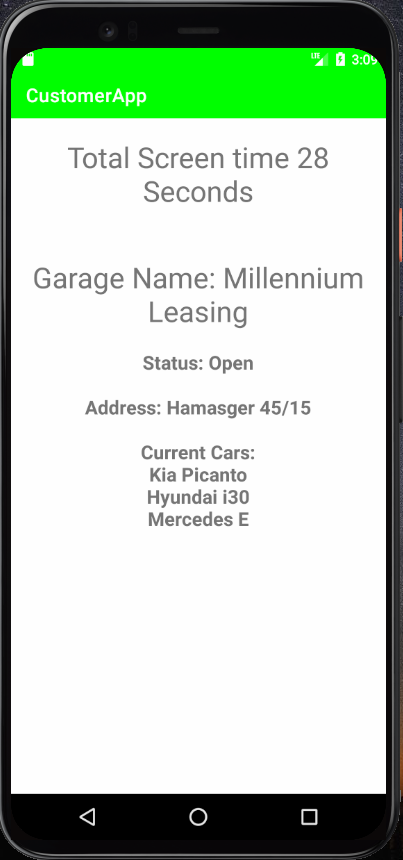
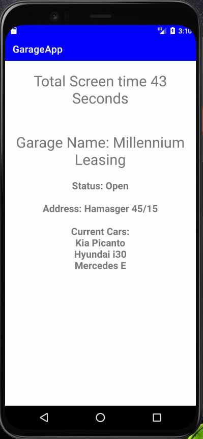

# MyGarageMultiApp

Hi Everyone,

this is my second project in Advance Moblie course

(Made by Lior Trachtman & Noar Farag)

This App includes two applications that share a common module that pulls information from the server with Retrofit 
library and calculates usage time with the help of Room library.

Comment to Guy & Tom

Hope you enjoy.

  

